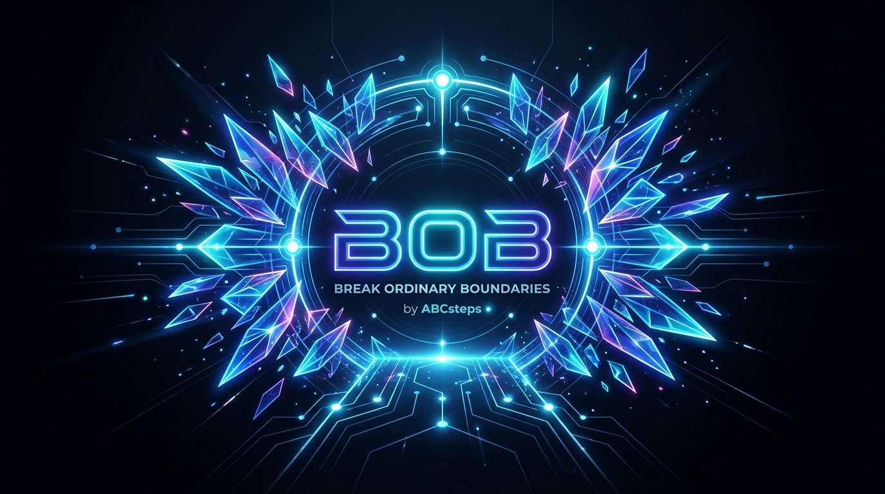
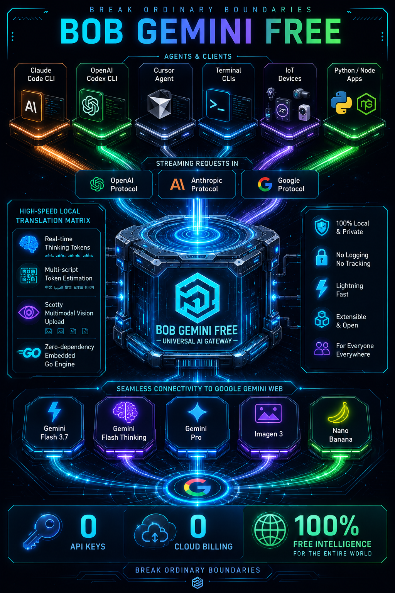
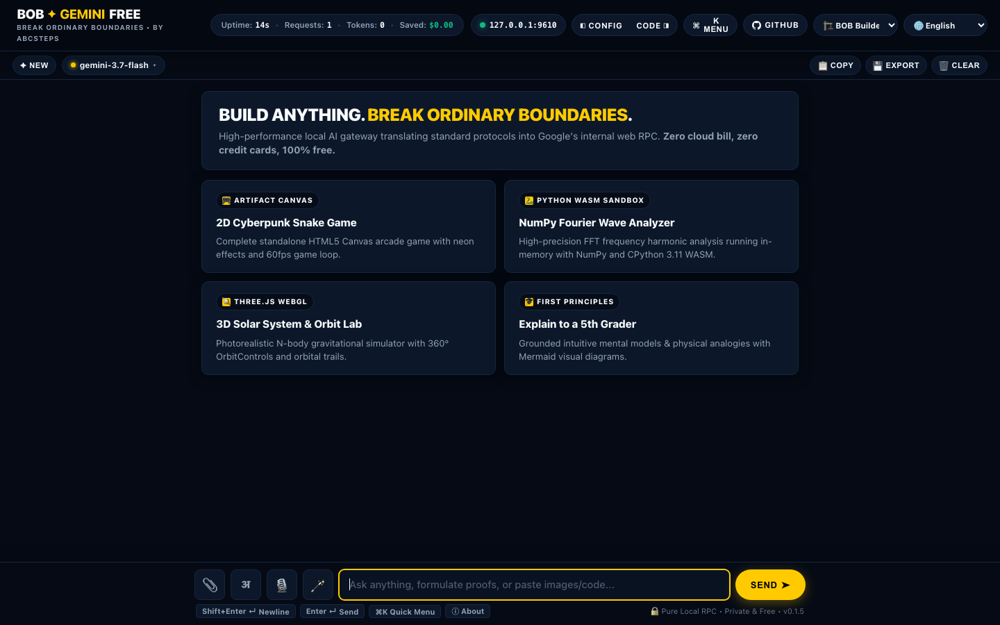
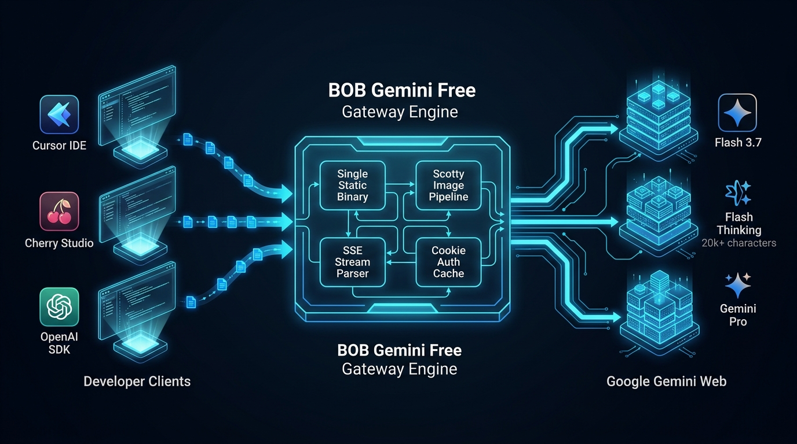

<p align="center">
  
</p>

<h1 align="center">BOB Gemini Free</h1>

<p align="center">
  <strong>Multi-Protocol AI Gateway Engine</strong><br>
  <em>OpenAI-shaped, Anthropic-shaped, and Google Gemini adapter routes for developers and agents</em>
</p>

<p align="center">
  <a href="https://abcsteps.com/"></a>
  <a href="https://github.com/div197/bob-gemini-free"></a>
  
  
  
  
</p>

<p align="center">
  <a href="README.md"><strong>English Documentation</strong></a> &nbsp;•&nbsp;
  <a href="README.hi.md"><strong>हिंदी गाइड (Hindi)</strong></a> &nbsp;•&nbsp;
  <a href="CHANGELOG.md"><strong>Changelog</strong></a>
</p>

---

**BOB Gemini Free** is part of the **BOB Series** (*Break Ordinary Boundaries*) developed by [**ABCsteps.com**](https://abcsteps.com/) — an online AI engineering school founded by **Divyanshu Singh Chouhan** ([@div197](https://github.com/div197)) in Jodhpur, Rajasthan, India.

---

## Engineering Status & Evidence Boundary

Phase II has regression-locked the fragile protocol core and documented what
is actually known in [`docs/engineering/VERIFICATION-MATRIX.md`](docs/engineering/VERIFICATION-MATRIX.md).

| Status | Current meaning |
|---|---|
| **Implemented** | Local routes, protocol adapters, stream retry deduplication, `/healthz`, origin filtering, signed-update verification, native desktop port selection, and aggregate metrics |
| **Native updater status** | The signed `v0.2.0-preview.1` migration bridge is public for existing Preview 7 Macs; it adds explicit Preview → Stable migration for newly built previews. Stable `v0.2.0` remains gated on pilot acceptance. Older builds with the unrecoverable key still require one manual migration |
| **Emulated** | OpenAI/Anthropic/Google tool calling is prompt/Markdown extraction, not native Google function calling; token counts are estimates |
| **Tested** | Fixture-based payload, auth, parser, stream, thinking, tool, adapter, upload, security, updater, desktop, and local benchmark paths; full Go tests, race tests, vet, and host build pass on the audit host |
| **Measured** | Local-only benchmark results are recorded in [`LOCAL-BENCHMARK-2026-08-21.md`](docs/engineering/LOCAL-BENCHMARK-2026-08-21.md), [`LOCAL-BENCHMARK-2026-08-25.md`](docs/engineering/LOCAL-BENCHMARK-2026-08-25.md), and the current [`LOCAL-BENCHMARK-2026-08-29.md`](docs/engineering/LOCAL-BENCHMARK-2026-08-29.md); they are not Google latency or rate-limit measurements |
| **Upstream-dependent** | Google model identity, entitlements, context limits, live compatibility, rate limits, authenticated vision/Imagen, and “free/unlimited” behavior |
| **Experimental** | Pro/model aliases, image-generation routing, live browser login, and any capability not proven by an authorized live session |

The Go gateway sends no automatic telemetry, but the browser studio loads
third-party CDN assets and an input-tools endpoint. Hosted Studio access to a
local gateway requires an exact configured origin (and should also use an API
key); PNA is not authentication.

BOB Gemini Free does not create a BOB account, require a BOB signup, or send
chat prompts to a BOB cloud service. Google authentication, when needed, is
the student's own provider session and remains subject to Google's policies,
expiry, entitlements, and network behavior.

The exact boundary between anonymous web access, optional Google web cookies,
shared school-network egress, local health, and provider limits is documented
in [`UPSTREAM-AUTHENTICATION-BOUNDARY.md`](docs/engineering/UPSTREAM-AUTHENTICATION-BOUNDARY.md).

---

## 🌟 The Philosophy: Why "Break Ordinary Boundaries"?

In the modern AI landscape, learners, independent creators, and developers constantly hit **three ordinary boundaries**:

1. 💸 **The Economic Boundary (Cost Barrier)**: Frontier AI models often require expensive monthly subscriptions or high pay-per-token API credit cards. A student or solo builder experimenting with multi-agent coding can burn through hundreds of dollars in a few days.
2. 🔒 **The Ecosystem Boundary (Platform Lock-in)**: Closed ecosystems trap developers — Anthropic tools only talk to Anthropic, OpenAI tools only talk to OpenAI, and Google Gemini's web power remains trapped inside a browser tab.
3. ⚙️ **The Complexity Boundary (Friction & Setup Hell)**: Most proxy tools require compiling dependencies, installing runtimes (Python, Go, Node), or copy-pasting cryptic tokens with confusing error dialogs.

**BOB is designed to address all three**:
- 🧭 **Session-Dependent Access**: The available model, reasoning, image, quota, and context behavior follows the configured Google web session.
- 🔓 **The "API-Less AI" Architecture**: No gateway billing account is required, but a Google session and Google's current entitlements still govern upstream access.
- 🌉 **Multiple Adapter Surfaces**: One local gateway exposes OpenAI-shaped, Anthropic-shaped, Google Gemini-shaped, and embedded Go interfaces. Compatibility is endpoint-specific and tool calling is emulated in some paths.
- ⚡ **Packaged runtime simplicity**: A packaged CLI or desktop release carries
  its runtime and does not require users to install Go, Python, Node, SQLite,
  or a separate memory service. Building from source still requires the
  documented toolchain. The optional **1-Click Native Login Window (`--login`)
  ** remains dependent on the local browser and Google.

---

## 🚀 The "API-Less AI" Paradigm: True Freedom for Developers

Traditional developer tools force you through a maze of cloud billing setups, credit cards, and pay-per-token API fees. **BOB Gemini Free introduces the API-Less AI model**:

| Traditional Cloud API Model | The BOB API-Less Architecture |
| :--- | :--- |
| 💳 Requires credit card & billing account | **$0.00 / Zero credit cards needed** |
| 💸 Pay per million tokens & reasoning steps | **No gateway billing; upstream quotas still apply** |
| 🔑 Fragile API keys prone to leaks & theft | **Secure local session locked with `0600` permissions** |
| 🔒 Locked to single vendor CLI or protocol | **Multiple adapter surfaces (OpenAI, Anthropic, Google, Go)** |
| 📊 Blind monthly invoices | **Local estimated usage and savings counters (`GET /`)** |

---

<p align="center">
  
</p>

---

## 💡 How It Works (In Plain English)

Think of **BOB Gemini Free** as a fast, private **Universal Translator** that runs quietly in the background on your laptop:

```
┌─────────────────────────────────────────────────────────────┐
│  Deep Agentic Coding Tools & Autonomous Frameworks          │
│  (Codex CLI, Claude Code CLI, Cursor, Grok Build, OpenHands)│
└──────────────────────────────┬──────────────────────────────┘
                               │ Speaks standard OpenAI / Anthropic API
                               ▼
┌─────────────────────────────────────────────────────────────┐
│  ⚡ BOB Gemini Free (Local Gateway on your machine)          │
│  Translates requests locally; UI asset calls are separate   │
└──────────────────────────────┬──────────────────────────────┘
                               │ Speaks Google Web RPC Stream
                               ▼
┌─────────────────────────────────────────────────────────────┐
│  🌐 Google Gemini Web (Flash 3.7 / Thinking / Pro / Images)  │
└─────────────────────────────┘
```

When a supported client asks for an API response, it sends a request to BOB. BOB translates the supported request shape into Gemini's web format and returns the adapter response; reasoning, vision, latency, and model behavior remain endpoint- and session-dependent.

---

## The BOB Series (*Break Ordinary Boundaries*)

The **BOB Series** by **ABCsteps** is a developer-first collection of open-source runtimes and engines designed to remove paywalls and artificial constraints from modern software workflows:

* ⚡ [**BOB Gemini Free**](https://github.com/div197/bob-gemini-free) — Multi-protocol local gateway exposing Google Gemini Web through adapter routes for coding agents, IDEs, and developer tools.
* 🎥 [**BOB YouTube**](https://github.com/div197/BOB-Youtube) — Docker-first YouTube ingestion and transcription runtime for developers, products, and AI agents.

---

## Key Features

* **Session-Dependent Google Routing**: Model access, reasoning, image, quota, and context behavior follows the current Google web session.
* **Multiple Protocol Adapters**: OpenAI-shaped, Anthropic-shaped, Google-shaped, and embedded Go endpoints are implemented and fixture-tested; this is not a universal/native guarantee for every client feature.
* **Estimated Token Counting**: `POST /v1beta/models/{model}:countTokens` and `POST /v1/tokens/count` provide local estimates, not Google's authoritative tokenizer.
* **Local Aggregate Metrics**: Safe request, latency, pool, upload, cache, and token-estimate counters are available locally; no automatic telemetry is transmitted.
* **Live Diagnostic Suite**: The built-in `./bob-gemini-free --test` command and `--bench` runner need an explicitly running gateway and may depend on upstream access.
* **1-Click Native Login Window (`--login`)**: The browser workflow attempts to capture session tokens in an isolated profile; login success remains dependent on the local browser and Google.
* **Multi-Account Cookie Pool (`cookie_pool`)**: Route explicitly supplied Google web sessions with a local 60-second failure cooldown; it is not a quota increase, rate-limit bypass, or safe reason to share one cookie across students.
* **Authenticated Pro Routing Path**: A configured session may expose Google's Pro aliases when the upstream account and current web protocol support them; this is not guaranteed by the gateway.
* **Image-Generation Routing Path**: `/v1/images/generations` is implemented, but Imagen/Nano Banana output remains experimental and upstream-dependent.
* **Anthropic-Shaped Thinking Support**: Accepts Anthropic-style thinking fields and emits the adapter's reasoning blocks; it is not native Claude inference.
* **Multimodal Vision Path**: Send base64 images or public image URLs via standard OpenAI payloads — uploaded through Google's Scotty resumable path when an authenticated session permits it.
* **Privacy First & Local Gateway**: Safe default loopback binding (`127.0.0.1`) and no automatic telemetry from the Go gateway; memory and upstream performance must be measured for the target build.

## Supported Tools & Ecosystem

BOB Gemini Free can be configured for the following tools. Compatibility is
endpoint- and feature-specific; each client should be tested against the
adapter route it uses before classroom or production adoption:

| Category | Supported Clients & Frameworks | Connection Endpoint |
| :--- | :--- | :--- |
| **Terminal Coding Agents** | OpenAI Codex CLI (`codex`), Claude Code CLI (`claude`), Aider CLI (`aider`), Gemini CLI (`gemini`) | Protocol adapters via custom base URLs |
| **Agentic IDEs & Extensions** | Cursor (Agent Mode), Roo Code, Cline, Continue.dev, Windsurf | `http://127.0.0.1:9610/v1` |
| **Autonomous Agent Runtimes** | Grok Build, OpenHands, SWE-agent, Goose, LangChain, CrewAI, AutoGen, OpenAI Agents SDK | `http://127.0.0.1:9610/v1` |
| **Routers & Local Proxies** | LiteLLM, OneAPI, NewAPI, Portkey, OpenRouter | `http://127.0.0.1:9610/v1` |
| **Official SDKs** | OpenAI (Python/JS/Go/.NET/Java), Anthropic (Python/TypeScript), Google GenAI | Local Base URLs |

---

## Quick Start (local and packaged paths)

### Local Start (no BOB account required)

```bash
# 1. Start the gateway
./bob-gemini-free

# 2. Point any AI tool or script to:
# Base URL: http://127.0.0.1:9610/v1
# API Key:  none unless you configure local gateway API keys
```

---

### Option 0: The Native Desktop App (Recommended)
BOB Gemini Free has a **native desktop application** powered by Go. It bundles the studio and gateway, probes for an existing compatible local gateway, selects a safe loopback port when needed, and hands the actual endpoint to the frontend.
* A locally built packaged app opens without Go, Node, Rust, SQLite, or a separate server.
* The latest stable GitHub release contains CLI binaries. The public [v0.2.0-preview.1 migration bridge](https://github.com/div197/BOB-Gemini-Free/releases/tag/v0.2.0-preview.1) is the current macOS universal preview for existing Preview 7 installations and contains the corrected branded package, signed project update manifest, native maximize behavior, default-browser link routing, expanded English/Hindi studio UI, bounded provider retries, and visible failure handling. It is an authentic open-source beta, platform trust is not yet established, and Windows/Linux remain separate preview targets. Stable `v0.2.0` is not yet published; see [`RELEASE-READINESS-v0.2.0.md`](docs/engineering/RELEASE-READINESS-v0.2.0.md).
* For a free macOS evaluation package, run `make desktop-preview-mac`; it is ad-hoc signed and explicitly not notarized or production-ready.
* Build the native app with `make desktop` or follow the platform matrix in [`docs/engineering/STUDENT-DISTRIBUTION.md`](docs/engineering/STUDENT-DISTRIBUTION.md).
* Anonymous upstream access may be available, but authenticated Google features remain account/session-dependent. Never distribute one shared student cookie.
* The current source has a build-pinned update policy. Newly built previews can
  discover a newer signed stable release for an explicit Preview → Stable
  migration, or a newer signed preview when stable has no update, verify it,
  and install it after explicit user consent with rollback protection. The
  already-published Preview 7 binary predates stable-first discovery, so it can
  first install the published same-key bridge preview before updater-based
  migration to stable, or use one manual stable install. Preview 3 still needs one manual migration because
  it predates the embedded trust key. Preview 6 also needs one manual migration
  to Preview 7 because the original Preview 6 signing key was not recoverable.
  The one-clean-Mac, pilot, and 20–30-device gates are documented in
  [`PREVIEW-ROLLOUT-VALIDATION.md`](docs/engineering/PREVIEW-ROLLOUT-VALIDATION.md).

---

### Option 1: CLI Installer (No Go Required)

These scripts install the standalone CLI gateway and open the browser studio.
They are the currently published, same-day path; they do **not** install the
native desktop application. Native desktop packages are only available
when the corresponding artifact is listed in the GitHub Release assets.

#### macOS & Linux
```bash
chmod +x install.sh
./install.sh
```

#### Windows (PowerShell)
```powershell
.\install.ps1
```

---

### Option 2: Docker & Docker Compose

```bash
# Using Docker Compose
docker compose up -d

# Or standard Docker
docker build -t bob-gemini-free .
docker run -d --name bob-gemini-free -p 9610:9610 bob-gemini-free
```

---

### Option 3: Automated Diagnostic Test Kit

Verify every endpoint, streaming chunk, reasoning model, and API format with the built-in diagnostic test kit:

```bash
# Run automated test kit against the default local server
./bob-gemini-free --test

# Or against a custom port / authenticated instance
./bob-gemini-free --test --test-url http://127.0.0.1:9610 --test-key your_api_key

# Or run the standalone script
./test-kit.sh
```

```text
[1/13]  [✔ PASS] Gateway Engine Health (GET /) (5ms)
[2/13]  [✔ PASS] OpenAI Models Registry (GET /v1/models) (0s)
[3/13]  [✔ PASS] Single Model Lookup (GET /v1/models/gemini-3.7-flash) (0s)
[4/13]  [✔ PASS] Gemini 3.7 Flash Fast Completion (3.0s)
[5/13]  [✔ PASS] Gemini 3.7 Flash Deep Reasoning (8.3s)
[6/13]  [✔ PASS] Real-time SSE Delta Stream & Usage (1.5s)
[7/13]  [✔ PASS] Developer Role & JSON Output Enforcement (3.9s)
[8/13]  [✔ PASS] Google-shaped Gemini Adapter Format (3.5s)
[9/13]  [✔ PASS] OpenAI Codex CLI Responses API Format (3.5s)
[10/13] [✔ PASS] Anthropic Messages API Protocol (POST /v1/messages) (3.2s)
[11/13] [✔ PASS] OpenAI Function Calling & Tool Invocation (4.1s)
[12/13] [✔ PASS] Image Generation & Gemini Nano Banana Pipeline (3.8s)
[13/13] [✔ PASS] Token Counting Engine (Google :countTokens & OpenAI /v1/tokens/count) (1ms)
==================================================================
    ALL 13 LOCAL DIAGNOSTIC CHECKS PASSED (example run)
==================================================================
```

### Live Status & Telemetry CLI (`--status`)

Query live metrics, token throughput, and estimated dollar savings from any running gateway directly in the terminal:

```bash
./bob-gemini-free --status
```

---

### Option 4: Native Background Service Daemonization (`service`)

Run BOB Gemini Free 24/7 in the background across system reboots with native OS daemons (macOS `launchd`, Linux `systemd`, Windows Startup):

```bash
# Install and enable auto-start on boot (Zero terminal windows needed)
./bob-gemini-free service install

# Check background daemon health and service definition
./bob-gemini-free service status

# Start / Stop / Uninstall daemon
./bob-gemini-free service start
./bob-gemini-free service stop
./bob-gemini-free service uninstall
```

---

### Option 5: CLI Signed Self-Updater (`--update`)

Keep the standalone CLI updated from the official GitHub release with one
explicit command:

```bash
./bob-gemini-free --update
```

Updates now fail closed unless the release publishes a signed `SHA256SUMS`
manifest and the matching Ed25519 public key is configured as
`BOB_GEMINI_FREE_UPDATE_PUBLIC_KEY` (base64 or hexadecimal). See
[`docs/engineering/UPDATE-VERIFICATION.md`](docs/engineering/UPDATE-VERIFICATION.md).

This CLI environment-key path is not the native desktop trust boundary.
Production native builds must embed their public key at build time. The public
`v0.2.0-preview.1` bridge carries that key; it still requires explicit user
consent and does not silently replace the app. See
[`docs/engineering/DESKTOP-UPDATE-OPERATIONS.md`](docs/engineering/DESKTOP-UPDATE-OPERATIONS.md).

---

### Option 6: Interactive Local-First Web Studio (`/playground` & `bob-gemini-free.abcsteps.com`)

Access the built-in visual studio directly in your web browser:
* 🌐 **Online Cloudflare Pages Web Studio**: **[bob-gemini-free.abcsteps.com](https://bob-gemini-free.abcsteps.com/)** *(static UI; gateway, session, and upstream limits still apply)*
* 🏠 **Local Server Address**: `http://127.0.0.1:9610/playground` (or `/ui`)

#### 🌟 Client Capabilities (subject to browser, gateway, and upstream limits):
* 🔒 **Local-First Privacy**: The static studio can connect to a local gateway, but a hosted origin must be explicitly listed in `allowed_origins`/`BOB_GEMINI_FREE_ALLOWED_ORIGINS`; PNA is not authentication. Hosted pages do not probe loopback on startup; `Gateway Offline → Test Ping` is the explicit connection action, and the browser may ask for local-network permission then. No prompts or thinking tokens are sent to an intermediate BOB server by the Go gateway.
* 🐍 **Institutional-Grade In-Browser Pyodide WASM Python Sandbox**: Live client-side CPython 3.11 execution in an isolated WebAssembly sandbox with zero server-side execution risk, zero Python setup, interactive `input()` support, and automatic scientific package wheel streaming (`numpy`, `pandas`, `matplotlib`, `scipy`, `sympy`).
* 🧭 **No server database or memory service**: The gateway is stateless between requests apart from its explicit session pool and safe aggregate counters; the studio does not provision SQLite or a server-side database.
* ⚡ **Native Interactive Artifacts Canvas Studio (Claude-Class Live Sandbox)**: Automatically detects and compiles standalone HTML5 applications, CSS3 animations, Canvas 2D/WebGL simulations, SVG vector graphics, and Mermaid diagrams with 1-click **`Launch ⚡`** chips, a sandboxed `iframe` studio modal (`[ ▶ Preview | ⟨/⟩ Code ]`), sandbox reload (`⟳`), source copy, and standalone window pop-out (`⛶`).
* 🪄 **Prompt assistant (`🪄`)**: Attempts prompt improvement through the local
  gateway; when that request is unavailable it returns a clearly local,
  heuristic template. The template is not a provider response or a guarantee
  of AI inference.
* 🔍 **Non-Breaking Reading Text Zoom Controller (`🔍 100%`)**: Targeted typography scaling (`calc(0.92rem * var(--reading-zoom))`) via sub-bar pill, `⌘+`/`⌘-`/`⌘0`, and Command Palette without breaking outer geometry, headers, or navigation.
* 🏛️ **Unified Sacred Geometry Studio Input Capsule**: Single cohesive dark-glass input capsule seamlessly housing auto-expanding textarea, vision attachments, power tools (`📎`, `अ Indic`, `🎙️ Voice`, `🪄 AI Wand`), and the golden `SEND ➤` CTA across mobile and desktop.
* 🎙️ **Natural HD Speech Studio & Floating Audio Controller Bar**: NotebookLM-class neural voice synthesis with Play/Pause (`⏸️`/`▶️`), speed cycling (`0.8x`–`1.5x`), 4-bar sound equalizer (`ılılı`), and sentence progress tracking.
* ✏️ **In-Place User Message Editing & Conversation Branching**: Inline editing with `✏️`, auto-growing editor, and conversation rewind (`Ctrl+Enter` / `Escape`).
* 🌐 **Bilingual & Multi-Indic Internationalization (`en` / `hi` + 8 Regional Scripts)**: 1-click dynamic language switcher and ⌘K shortcuts (`L1` English, `L2` हिन्दी), with support for 8 regional Indic scripts (हिन्दी, संस्कृतम्, मराठी, বাংলা, ગુજરાતી, தமிழ், తెలుగు, ਪੰਜਾਬੀ).
* ✍️ **Real-Time Indic Phonetic Transliteration with Backspace Undo**: Space-key dynamic conversion of Roman transliteration (`"namaste"`, `"aap kaise ho"`) into native Devanagari (`"नमस्ते"`, `"आप कैसे हो"`). Hitting `Backspace` instantly reverts converted words back to their original Roman characters.
* 🏛️ **Indian School Computer Lab LAN Master Architecture**: 1-process LAN host topology (`--host 0.0.0.0 --port 9610`) for 30-PC computer labs, with a dedicated [Classroom LAN Deployment Guide](docs/1-getting-started/classroom-lan-guide.md) explaining when to use local gateway mode instead of Cloudflare Pages for concentrated student traffic.
* 👁️ **Multimodal Vision Engine**: Attach files (`📎`), drag-and-drop images onto the canvas, or paste screenshots directly from your clipboard (`⌘V` / `Ctrl+V`).
* 🧠 **Real-Time Reasoning Visualizer**: Stream step-by-step thinking tokens live inside isolated reasoning cards without distracting from the main response.
* 📐 **Synchronous Scientific Typography (KaTeX)**: Zero-flicker mathematical rendering for Dirac bra-kets ($\langle \psi | \phi \rangle$), Hilbert spaces, matrices ($\begin{pmatrix}1\\0\end{pmatrix}$), integrals, and proofs.
* ⚡ **Multi-Language Terminal Highlighting (Prism.js)**: Syntax highlighting across 200+ programming languages with one-click **`📋 Copy`** and **`💾 Save`** actions.
* 📊 **Interactive Architecture Diagrams (Mermaid.js)**: Automatically renders ````mermaid ```` blocks into live interactive SVG flowcharts and sequence diagrams.
* ⌨️ **Spotlight Command Palette (`⌘K` / `Ctrl+K`) & Keybindings**:
  * `1`–`5`: Switch between flagship models (`gemini-3.7-flash`, `thinking`, `gemini-3.1-pro`, `imagen-3`).
  * `T1`–`T5`: Switch Sacred Themes (Apple Design, BOB Builder, Vodafone Editorial, Spotify Dark, Gemini Quantum).
  * `G`: Open Gateway Engine Status & Endpoint Config • `N`: New Chat • `[` / `]`: Toggle sidebars • `E`: Export Markdown.
* 📊 **Local aggregate status**: The UI can display process-local uptime,
  request, token-estimate, latency, and estimated-savings counters. These are
  not external analytics or provider billing records.

<p align="center">
  
</p>

| Theme | Aesthetic Philosophy | Keybinding | Direct URL Preview |
| :--- | :--- | :---: | :--- |
| 🏗️ **BOB Builder** *(Default)* | Industrial high-contrast dark slate & energetic builder amber | `T1` | [View Snapshot](assets/theme-bob-builder.png) • `/playground?theme=bob-builder` |
| 🍏 **Apple Design** | SF Pro typography, frosted glass, parchment cards & Action Blue | `T5` | [View Snapshot](assets/theme-apple.png) • `/playground?theme=apple` |
| 📰 **Vodafone Editorial** | Clean light editorial paper, serif typography & crisp crimson | `T2` | [View Snapshot](assets/theme-vodafone.png) • `/playground?theme=vodafone` |
| 🎧 **Spotify Dark** | Pure AMOLED obsidian deep pitch & electric emerald green | `T3` | [View Snapshot](assets/theme-spotify.png) • `/playground?theme=spotify` |
| ⚛️ **Gemini Quantum** | Cyber deep indigo canvas & luminescent cyan neon glow | `T4` | [View Snapshot](assets/theme-quantum.png) • `/playground?theme=quantum` |

---

### Option 5: Build from Source with Make or Go (Go 1.26.6 in this snapshot)

```bash
# Build binary
make build

# Start the gateway
./bob-gemini-free --port 9610
```

The gateway will start listening at `http://127.0.0.1:9610/v1`.

---

## 📂 Multi-Language Examples & Client Integrations

Endpoint-specific integration examples are located in the [`examples/`](examples/)
directory. They are starting points, not a universal compatibility or
production certification:

* 🐍 **Python**:
  * [`examples/python/openai_chat.py`](examples/python/openai_chat.py) — OpenAI SDK with streaming reasoning extraction (`reasoning_content`).
  * [`examples/python/anthropic_messages.py`](examples/python/anthropic_messages.py) — Anthropic SDK Messages API with extended thinking.
* 🟨 **Node.js / TypeScript**:
  * [`examples/nodejs/openai_chat.mjs`](examples/nodejs/openai_chat.mjs) — OpenAI npm SDK stream consumer.
  * [`examples/nodejs/anthropic_messages.mjs`](examples/nodejs/anthropic_messages.mjs) — `@anthropic-ai/sdk` Messages API client.
* 🔷 **Go (Embedded Engine)**:
  * [`examples/go/embedded_sdk.go`](examples/go/embedded_sdk.go) — Direct in-process Go programmatic inference (`pkg/gateway.NewEngine()`).
* 🐚 **cURL & Shell**:
  * [`examples/curl/chat.sh`](examples/curl/chat.sh) — Standard completion.
  * [`examples/curl/stream_thinking.sh`](examples/curl/stream_thinking.sh) — Real-time reasoning stream.
  * [`examples/curl/anthropic.sh`](examples/curl/anthropic.sh) — Anthropic messages endpoint.
  * [`examples/curl/responses_codex.sh`](examples/curl/responses_codex.sh) — OpenAI Codex CLI `/v1/responses`.

---

## Client Integration

### OpenAI Python SDK

```python
from openai import OpenAI

client = OpenAI(
    base_url="http://127.0.0.1:9610/v1",
    api_key="none"  # Or your configured api_key
)

# Text Chat Completion with Deep Thinking
response = client.chat.completions.create(
    model="gemini-3.7-flash-thinking",
    messages=[
        {"role": "user", "content": "Explain quantum error correction step by step."}
    ]
)
print(response.choices[0].message.content)
```

### Multimodal Vision (OpenAI Format)

```python
import base64
from openai import OpenAI

client = OpenAI(base_url="http://127.0.0.1:9610/v1", api_key="none")

with open("diagram.png", "rb") as img_file:
    b64_img = base64.b64encode(img_file.read()).decode("utf-8")

response = client.chat.completions.create(
    model="gemini-3.6-flash",
    messages=[
        {
            "role": "user",
            "content": [
                {"type": "text", "text": "What architecture is depicted in this image?"},
                {"type": "image_url", "image_url": {"url": f"data:image/png;base64,{b64_img}"}}
            ]
        }
    ]
)
### Claude Code CLI & Anthropic SDK (Anthropic-shaped adapter)

BOB Gemini Free implements a tested subset of Anthropic's Messages API shape
(`POST /v1/messages`). It is an adapter/emulation layer backed by Google's
web protocol, not native Claude inference; client and tool compatibility remain
endpoint-specific.

#### Claude Code CLI Setup

```bash
export ANTHROPIC_BASE_URL=http://127.0.0.1:9610
export ANTHROPIC_API_KEY=none
claude
```

#### Anthropic Python SDK

```python
from anthropic import Anthropic

client = Anthropic(
    base_url="http://127.0.0.1:9610",
    api_key="none"
)

message = client.messages.create(
    model="gemini-3.7-flash-thinking",
    max_tokens=4096,
    messages=[
        {"role": "user", "content": "Write a concurrent Go worker pool."}
    ]
)
print(message.content[0].text)
```

### OpenAI Codex CLI

```bash
export OPENAI_BASE_URL=http://127.0.0.1:9610/v1
export OPENAI_API_KEY=none
codex
```

### cURL (OpenAI Chat Completions)

```bash
curl http://127.0.0.1:9610/v1/chat/completions \
  -H "Content-Type: application/json" \
  -d '{
    "model": "gemini-3.7-flash",
    "messages": [{"role": "user", "content": "Hello BOB Gemini Free!"}]
  }'
```

### OpenAI Image Generation (`POST /v1/images/generations`)

```python
from openai import OpenAI

client = OpenAI(
    base_url="http://127.0.0.1:9610/v1",
    api_key="none"
)

response = client.images.generate(
    model="dall-e-3",
    prompt="A futuristic neon cybernetic logo for BOB Gemini Free, digital art, 8k",
    size="1024x1024",
    n=1
)
print("Generated Image URL:", response.data[0].url)
```

> [!NOTE]
> **Imagen Tool Authentication**: Google requires an active signed-in Google account for Imagen image generation. When running without cookies in anonymous mode, Gemini returns an informative policy response. To unlock Imagen generation, attach your session cookie via `--cookie-file cookie.txt` or `--setup-cookie`.

### Gemini CLI (Google-shaped adapter)

```bash
export GEMINI_API_KEY=none
export GOOGLE_GEMINI_BASE_URL=http://127.0.0.1:9610
gemini
```

### Embedded Go Library / Package Import

Embed BOB Gemini Free directly as an in-process module inside any Go application or agent runtime:

```go
package main

import (
	"net/http"
	"github.com/div197/bob-gemini-free/pkg/gateway"
)

func main() {
	handler := gateway.NewHandler(
		gateway.WithDefaultModel("gemini-3.7-flash"),
		gateway.WithCookieFile("cookie.txt"), // optional
	)

	http.ListenAndServe("127.0.0.1:9610", handler)
}
```

---

## Deep Architectural Comparison: Google AI Studio vs. BOB Gemini Free

### Official Limits & Feature Matrix (Free Tier Without Paid Billing)

| Dimension / Metric | Google AI Studio (Free Tier) | **BOB Gemini Free (Local Gateway Engine)** |
| :--- | :--- | :--- |
| **Flash Daily Limit (RPD)** | **1,500 Requests / Day** (provider limit) | **Not established; depends on the Google web session** |
| **Flash Rate Limits (RPM)** | **15 Requests / Minute** (`429 RESOURCE_EXHAUSTED`) | **Not established; do not infer a gateway quota** |
| **Flash Token Rate (TPM)** | 1,000,000 Tokens / Minute | Stream-buffered interactive throughput |
| **Pro Daily Limit (RPD)** | **50 Requests / Day** (Punishing hard cap) | **Not established; depends on the Google web session** |
| **Pro Rate Limits (RPM)** | **2 Requests / Minute** (Severe throttling) | **Standard interactive web concurrency** |
| **Thinking Reasoning Depth** | Restricted / suppressed on free keys | **Upstream-dependent; no fixed character guarantee** |
| **OpenAI Protocol Support** | ❌ None (Requires custom SDK / glue code) | **✅ Implemented adapter routes; compatibility is fixture-tested, not universal/full** |
| **Developer Role Support** | ❌ None | **✅ Adapter parsing with prompt transformation; not native role semantics** |
| **Reasoning Tokens Export** | ❌ Proprietary format | **✅ Standard `reasoning_content` (renders cards in Cursor/OpenWebUI)** |
| **Data Training & Logging** | ⚠️ Provider policy applies | **🛡️ Local gateway bound to `127.0.0.1`; no automatic telemetry from the Go process** |
| **Setup Friction** | Cloud console, project creation, API key rotation | **Single binary; Google session/configuration may still be required** |
| **Total Financial Cost** | $0 (until throttled) or paid per-token bill | **No gateway billing; Google account/session entitlements still apply** |

The Pro, thinking-depth, and concurrency values sometimes shown in older material are
not verified release guarantees. Model access, quotas, context limits, and output depth
remain dependent on Google's current web session and should be measured in the target
environment.

---

### Operational Limits & Measurement Boundary

The following values are not verified release guarantees. Provider quotas, account state,
network conditions, and model behavior must be measured in the target environment:

* **Output/context limits**: Not established as fixed gateway values; Google web behavior is upstream-dependent.
* **Concurrency**: The repository includes local benchmark profiles at 1, 10, 50, and 100 concurrent requests. Those results do not establish Google rate limits or safe live concurrency.
* **Automatic retry strategy**: Configurable retry attempts and a fixed retry delay are implemented; upstream errors and rate limits can still surface.
* **Images**: The compression path attempts to reduce oversized inputs and cap dimensions before upload; an exact final byte size is not guaranteed.

---

## Live Performance & Stress Benchmark

BOB Gemini Free includes a live-endpoint stress tester and a separate local-only benchmark:

```bash
# Run benchmark with 3 concurrent workers and 6 batch queries
./bob-gemini-free --bench --bench-concurrency 3 --bench-requests 6

# Or benchmark against a custom URL / port
./scripts/bench.sh http://127.0.0.1:9610 3 6 your_api_key
```

The reproducible local-only profiles are `go run ./cmd/benchmark-local -requests 100`
with concurrency `1,10,50,100`; measured results and methodology are in
[`docs/engineering/LOCAL-BENCHMARK-2026-08-21.md`](docs/engineering/LOCAL-BENCHMARK-2026-08-21.md).
The live benchmark is upstream-dependent and must not be compared with that
local baseline without recording environment, date, version, and session.

---

## Background Daemon & Auto-Start Services

Keep BOB Gemini Free running silently in the background across all major operating systems:

### Linux (Systemd Service)

```bash
# 1. Copy binary and service file
sudo cp bob-gemini-free /usr/local/bin/
sudo cp scripts/bob-gemini-free.service /etc/systemd/system/

# 2. Enable and start on boot
sudo systemctl daemon-reload
sudo systemctl enable --now bob-gemini-free
```

### macOS (Launchd Daemon)

```bash
# 1. Copy binary to path
sudo cp bob-gemini-free /usr/local/bin/

# 2. Install plist to user LaunchAgents
cp scripts/com.abcsteps.bob-gemini-free.plist ~/Library/LaunchAgents/
launchctl load ~/Library/LaunchAgents/com.abcsteps.bob-gemini-free.plist
```

### Windows (Background Auto-Start)

```cmd
REM Run the background batch runner
scripts\start-service.bat
```

---

## Model Matrix & Reasoning Controls

| Local Model Alias | Backend Mode | Default Think Depth | Output Profile | Auth Requirement |
| :--- | :---: | :---: | :--- | :--- |
| `gemini-3.7-flash` | Mode 1 | `@think=4` | Fast-mode alias; behavior is upstream-dependent | Session/provider-dependent |
| `gemini-3.7-flash-thinking` | Mode 2 | `@think=0` | Thinking-mode alias; depth is upstream-dependent | Session/provider-dependent |
| `gemini-3.6-flash` / `gemini-flash` | Mode 1 | `@think=4` | Flash-mode alias | Session/provider-dependent |
| `gemini-3.5-flash-thinking` / `gemini-thinking` | Mode 2 | `@think=0` | Thinking-mode alias | Session/provider-dependent |
| `gemini-3.5-flash-thinking-lite` | Mode 5 | `@think=0` | Lite thinking-mode alias | Session/provider-dependent |
| `gemini-flash-lite` / `gemini-lite` | Mode 6 | `@think=4` | Lite-mode alias | Session/provider-dependent |
| `gemini-auto` | Mode 4 | `@think=4` | Auto-routing alias | Session/provider-dependent |
| `gemini-3.1-pro` / `gemini-pro` | Mode 3 | `@think=4` | Flagship Pro reasoning & code | **Gemini Advanced Cookie** |
| `gemini-3.1-pro-enhanced` | Mode 3 | `@think=4` | Pro with enhanced output (experimental) | **Gemini Advanced Cookie** |

### Dynamic Thinking Depth Override

Append `@think=N` to any model alias in your client to control reasoning depth on the fly:

```text
gemini-3.6-flash@think=0    # Deepest step-by-step reasoning tokens
gemini-3.6-flash@think=2    # Balanced medium reasoning
gemini-3.6-flash@think=4    # Direct fast response (shallowest reasoning)
```

---

## Architecture & Data Flow

<p align="center">
  
</p>

BOB Gemini Free bridges modern developer clients directly to Google Gemini's web infrastructure:
1. **Client Tier**: Receives standard OpenAI/Gemini REST calls from Cursor, Cherry Studio, ChatBox, OpenWebUI, or Python/TS SDKs.
2. **Gateway Engine**: Translates OpenAI message arrays into Google BoQ RPC payloads, compresses oversized multimodal vision uploads via Google Scotty, extracts thinking traces into `reasoning_content`, and deduplicates real-time SSE stream frames.
3. **Google Web Tier**: Dispatches requests directly over TLS with browser fingerprint impersonation and dynamic `SAPISIDHASH` authentication.

---

## Unlocking Pro: Gemini Advanced ($20/mo) Cookies & Session Setup

Flash, thinking, and lite aliases are available only as local routing
contracts. Actual access, quotas, model identity, and required session state
must be checked with the live conformance runbook for the target account.

If you have an active **Google AI / Gemini Advanced ($20/mo)** subscription (or 18 months free via Reliance Jio / university partnership offers) or want to unlock **Imagen 3 Image Generation**, configure your session cookie to activate authentic **Pro** model routing (`gemini-3.1-pro` / `gemini-pro`).

---

### Step 1: Extract Your Cookie in 15 Seconds (3 Visual Paths)

Open **Google Chrome**, **Arc**, **Edge**, or **Brave** and visit [**gemini.google.com**](https://gemini.google.com). Make sure you are signed in.

```
┌─────────────────────────────────────────────────────────────────────────────┐
│  Chrome DevTools (F12 or Cmd+Opt+I)                                         │
├─────────────────────────────────────────────────────────────────────────────┤
│  [Network] Tab  Filter: [ app                   ] [X] Preserve log          │
│  ─────────────────────────────────────────────────────────────────────────  │
│  Name                                  Status   Type      Size              │
│  📄 app?eom=1&awwd=1&em=2&...          200      document  22.2 kB  <── CLICK│
│  ⚙️ batchexecute?rpcids=...            200      xhr       14.5 kB           │
│  ─────────────────────────────────────────────────────────────────────────  │
│  [Headers] [Payload] [Preview] [Response]                                   │
│  ▼ Request Headers                                                          │
│    :authority: gemini.google.com                                            │
│    Cookie: __Secure-BUCKET=...; SID=...; SAPISID=...;  <── RIGHT CLICK & COPY│
└─────────────────────────────────────────────────────────────────────────────┘
```

#### Path A: The Instant 1-Click Method (No Chat Needed)
1. Press **`F12`** (or **`Cmd + Option + I`** on macOS) to open Developer Tools.
2. Click the **Network** tab at the top.
3. Refresh the page (**`Cmd + R`** or **`F5`**).
4. Click on the document request named **`app?eom=1...`** (or any top **`batchexecute`** request).
5. In the right panel, ensure **Headers** is selected and scroll to **Request Headers**.
6. Right-click on the **`cookie:`** (or **`Cookie:`**) value and click **Copy value**.

#### Path B: The 1-Word Chat Method (`StreamGenerate`)
1. In DevTools **Network** tab, type **`StreamGenerate`** in the filter search box.
2. In Gemini, type any 1-word prompt (e.g. *"hi"*) and press Enter.
3. The request **`StreamGenerate`** will instantly appear in the Network list.
4. Click **`StreamGenerate`** $\rightarrow$ **Headers** $\rightarrow$ **Request Headers** $\rightarrow$ right-click **`cookie:`** $\rightarrow$ **Copy value**.

#### Path C: Application Storage Tab
1. In DevTools, click the **Application** tab (or click `>>` to find Application).
2. Expand **Storage** $\rightarrow$ **Cookies** $\rightarrow$ select `https://gemini.google.com`.
3. Highlight the cookie rows and copy.

---

### Step 2: Configure BOB Gemini Free (interactive or manual session setup)

#### 🌟 Method 0: 1-Click Interactive Sign-In Window (best-effort convenience)

Run the login command in your terminal:

```bash
./bob-gemini-free --login
```

```
┌─────────────────────────────────────────────────────────────┐
│  🌐 Sign in to Google Gemini (BOB Login Window)             │
├─────────────────────────────────────────────────────────────┤
│                                                             │
│                    Google                                   │
│                    Sign in with Google                      │
│                    [ your-email@gmail.com ]                 │
│                    [ Enter Password / Passkey ]             │
│                                                             │
│                    [ Next ]                                 │
│                                                             │
└─────────────────────────────────────────────────────────────┘
                              │
                              ▼ (User signs in once)
┌─────────────────────────────────────────────────────────────┐
│  [✔] Verified 19 session tokens!                            │
│  [✔] Saved to ./cookie.txt and ~/.config/bob-gemini-free/   │
│  [i] Session captured; provider capabilities remain account-dependent. │
└─────────────────────────────────────────────────────────────┘
```

1. A standalone Google Gemini sign-in window will open on your screen.
2. Sign in to your Google Account (supports Passkeys, 2FA, SMS).
3. As soon as login completes, BOB Gemini Free **attempts to capture the required session cookies via the Chrome DevTools Protocol**, saves `cookie.txt` (`mode 0600`) when successful, and closes the window.
4. The workflow is an attempt to capture the session; browser policy, Google
   changes, and local permissions can still require manual setup.

---

#### 📸 The Whole Truth: Multimodal Image Analysis (Vision) & Session Requirements

Google's internal web architecture strictly distinguishes between standard text reasoning and multimodal media uploads:

| Capability | Anonymous / Guest Session | Authenticated Google Session (`./cookie.txt` via `--login`) |
| :--- | :--- | :--- |
| **Text Chat & Coding** (`gemini-3.7-flash`, `gemini-3.6-flash`) | session/provider-dependent | session/provider-dependent |
| **Deep Step-by-Step Reasoning** (`gemini-3.7-flash-thinking`) | session/provider-dependent | session/provider-dependent |
| **Multimodal Image Analysis (Vision)** (Diagrams, Screenshots, OCR) | may fail without an authenticated session | an authenticated session may permit it; live proof is required |
| **Imagen 3 Image Synthesis** (`imagen-3`) | may fail | may be available; upstream/account-dependent |
| **Pro Model Routing** (`gemini-3.1-pro` / `gemini-pro`) | may fall back or fail | may be available; upstream/account-dependent |

**Why does Google require a session for images?**
When you attach an image or screenshot, BOB Gemini Free compresses the payload and initiates a resumable upload to Google's Scotty storage (`content-push.googleapis.com/upload/`). Google's backend verifies that the storage tenant is cryptographically signed by an authenticated Google account (`SAPISIDHASH` + `__Secure-1PSIDTS`). If unauthenticated or expired, Google returns `BardErrorInfo [1003]`. 

Running `./bob-gemini-free --login` attempts to capture a session for the
current user. Cookies can expire or be revoked, and provider capabilities must
be checked again after login; there is no permanent unlock guarantee.

---

#### Method A: Interactive Automated Setup Helper (Paste Prompt)

```bash
./bob-gemini-free --setup-cookie
```

Paste your copied cookie string and press **Enter**. The helper automatically:
* Extracts and cryptographically verifies all 19+ session tokens (`SID`, `HSID`, `SSID`, `APISID`, `SAPISID`, `__Secure-1PSID`, `__Secure-3PSID`, `SIDCC`).
* Activates dynamic SHA-1 **`SAPISIDHASH`** generation (`SAPISIDHASH <timestamp>_<sha1>`).
* Securely writes to `~/.config/bob-gemini-free/cookie.txt` with locked POSIX `0600` permissions.
* Instantly activates Pro routing (`gemini-3.1-pro`) and Imagen 3 synthesis.

#### Method B: Zero-Config Local `cookie.txt`

Paste your cookie directly into `./cookie.txt` in the gateway folder:

```bash
cat << 'EOF' > cookie.txt
PASTE_YOUR_COOKIE_STRING_HERE
EOF
chmod 600 cookie.txt
./bob-gemini-free
```
*(BOB Gemini Free automatically discovers `./cookie.txt` on startup without requiring any CLI flags).*

#### Method C: Direct Command-Line Flag or Environment Variable

```bash
# Non-interactive CLI flag
./bob-gemini-free --cookie-string "SID=...; HSID=...; SAPISID=...; __Secure-1PSID=..."

# Or via environment variable
export BOB_GEMINI_FREE_COOKIE_FILE="/path/to/cookie.txt"
./bob-gemini-free
```

---

### Step 3: Multi-Account Profile Handling (`auth_user`)

If you are signed into multiple Google accounts in the same browser (e.g. Account 0 = Personal, Account 1 = Work):

1. Check your Gemini browser URL:
   * `https://gemini.google.com/app` $\rightarrow$ Account Index is `0` (default).
   * `https://gemini.google.com/u/1/app` $\rightarrow$ Account Index is `1`.
2. Specify your account index in `config.json` or pass via CLI:
   ```json
   {
     "auth_user": "1",
     "cookie_file": "./cookie.txt"
   }
   ```
   This ensures BOB Gemini Free dispatches `X-Goog-AuthUser: 1` and prefixes `/u/1/` to route to the correct Google profile.

---

### Step 4: Multi-Account Cookie Pool & Auto-Rotation (`cookie_pool`)

For high-concurrency teams, AI labs, or automated pipelines requiring massive throughput:

1. Create a `cookies/` folder and place multiple cookie files:
   ```
   ./cookies/
   ├── account_primary.txt
   ├── account_secondary.txt
   └── account_team.txt
   ```
2. Or configure `"cookie_pool"` in `config.json`:
   ```json
   {
     "cookie_pool": [
       "./cookies/account_primary.txt",
       "./cookies/account_secondary.txt"
     ]
   }
   ```
3. **Automated Round-Robin & Failover**: BOB Gemini Free automatically load-balances requests across all active accounts. If one account encounters a temporary burst rate-limit (HTTP 429), BOB **automatically backs off that account for 60 seconds and transparently retries on the next healthy account** without interrupting the client connection!

---

### Step 5: Running with Docker & OrbStack

To run your authenticated container in Docker or **OrbStack**:

```bash
# 1. Build local container image
docker build -t bob-gemini-free:local .

# 2. Run container with cookie mounted
docker run -d \
  --name bob-gemini-free \
  -p 9610:9610 \
  -v $(pwd)/cookie.txt:/app/cookie.txt:ro \
  -e BOB_GEMINI_FREE_COOKIE_FILE=/app/cookie.txt \
  bob-gemini-free:local
```

Verify container status:
```bash
docker logs bob-gemini-free
# Output:
#   Cookie: yes (/app/cookie.txt)
#   Listening: http://0.0.0.0:9610
```

---

## Configuration (`config.json`)

Create `config.json` or place it in `~/.config/bob-gemini-free/config.json`:

```json
{
  "port": 9610,
  "host": "127.0.0.1",
  "retry_attempts": 3,
  "retry_delay_sec": 2,
  "request_timeout_sec": 180,
  "default_model": "gemini-3.6-flash",
  "api_keys": ["sk-your-secret-key"],
  "allowed_origins": [],
  "cookie_file": null,
  "proxy": null,
  "impersonate": "chrome_133",
  "log_requests": true
}
```

* **`host`**: Defaults to `127.0.0.1` for maximum security.
* **`api_keys`**: When empty `[]`, authentication is disabled. When configured, requests require `Authorization: Bearer <key>`.
* **`allowed_origins`**: Exact browser origins allowed to call the gateway. Loopback origins are allowed by default; hosted origins require explicit opt-in. `BOB_GEMINI_FREE_ALLOWED_ORIGINS` is the environment equivalent.
* **`impersonate`**: Mimic browser TLS signatures (`chrome_120`, `chrome_131`, `chrome_133`, `chrome_146`, `firefox_147`, `safari_16_0`).
* **`proxy`**: Route requests through an HTTP/HTTPS/SOCKS5 proxy (e.g. `http://127.0.0.1:7890`).

---

## Developer Commands (Makefile)

| Command | Description |
| :--- | :--- |
| `make build` | Compile static binary for host architecture into `./bob-gemini-free` |
| `make run` | Build and start server immediately on port 9610 |
| `make test` | Run complete unit test suite with verbose logging |
| `make test-cover` | Run test suite with line-by-line coverage report |
| `make dist` | Cross-compile standalone binaries for macOS (ARM64/Intel), Linux (AMD64/ARM64), and Windows |
| `make clean` | Remove local binaries and distribution directory |

---

## Frequently Asked Questions (FAQ)

<details>
<summary><strong>1. How does BOB Gemini Free avoid a gateway API key and billing account?</strong></summary>

**BOB Gemini Free** does not require its own paid gateway account or provider
API key for local development. It translates selected OpenAI-shaped and
Google-shaped requests into Google's internal web RPC; actual model access,
quota, authentication and cost are controlled by the current Google web
session and provider policy.
</details>

<details>
<summary><strong>2. Is my Google Account safe? What about rate limits or bans?</strong></summary>

* **Without a configured cookie**: BOB does not load a user-provided Google session file; upstream access and identity behavior are still provider-controlled and must not be described as anonymous or guaranteed.
* **In Gemini Advanced ($20/mo) Mode**: BOB Gemini Free uses authentic browser TLS fingerprints (`tls-client` impersonating Chrome 133) and standard web RPC payloads. It behaves identically to a user typing in a web browser tab.
* **Operational Best Practices**: Keep concurrency between 3 to 5 simultaneous requests. Do not blast 100 queries/second from a single IP to avoid temporary upstream rate limiting.
</details>

<details>
<summary><strong>3. How does this compare to Google AI Studio Free Tier or Paid OpenAI / Anthropic APIs?</strong></summary>

* **Google AI Studio Free Tier**: Enforces a strict 15 RPM (Requests Per Minute) and a hard daily token quota. Once you hit the quota, your app stops working until midnight UTC.
* **BOB Gemini Free**: Operates on Google's interactive web backend; daily limits, cost, and reasoning length remain Google-session-dependent and are not guaranteed by the gateway.
</details>

<details>
<summary><strong>4. How do I unlock Google's flagship Pro models (`gemini-3.1-pro` / `gemini-pro`) and Imagen 3?</strong></summary>

Out of the box, Free tier accounts access Flash 3.7, Flash 3.6, Flash Thinking, and Flash Lite. If you have an active Gemini Advanced ($20/mo) subscription (or 18 months free via Reliance Jio / college partnership offers):
1. Run `./bob-gemini-free --login` (Recommended 1-click native interactive sign-in).
2. Or run `./bob-gemini-free --setup-cookie` and paste your session cookie string.
3. The helper automatically extracts required tokens (`SID`, `HSID`, `SSID`, `APISID`, `SAPISID`, `__Secure-1PSID`, `__Secure-1PSIDTS`), computes dynamic `SAPISIDHASH` per request, and unlocks `gemini-3.1-pro` / `gemini-pro` and `imagen-3`.
</details>

<details>
<summary><strong>5. How does thinking / reasoning mode work? Where do I see thinking tokens?</strong></summary>

When querying thinking models (`gemini-3.7-flash-thinking` or any model with `@think=0`), BOB Gemini Free isolates internal reasoning traces (` ```thought ... ``` `) and populates the standard OpenAI `reasoning_content` field. In frontends like Cursor, Cherry Studio, ChatBox, or OpenWebUI, this automatically renders a collapsible "Reasoning Process" card alongside the clean final response.
</details>

<details>
<summary><strong>6. Can I run this on headless Linux VPS, Raspberry Pi, or Docker? What if datacenter IPs are challenged?</strong></summary>

Yes. BOB Gemini Free is a single Go binary with official multi-arch Docker support (`alpine:3.21`). Memory usage is build/environment dependent; see the measured local baseline.
* To bind publicly on a VPS, set `BOB_GEMINI_FREE_HOST=0.0.0.0` and configure `BOB_GEMINI_FREE_API_KEYS`.
* If a cloud datacenter IP (AWS, Hetzner, DigitalOcean) encounters Google WAF challenges, route traffic through a residential/SOCKS5 proxy via `--proxy socks5://...` or enable TLS browser impersonation (`--impersonate chrome_133`).
</details>

<details>
<summary><strong>7. Does this support Tool / Function Calling and Structured JSON Outputs?</strong></summary>

Partially. BOB Gemini Free injects tool schemas into prompts and parses Markdown ` ```tool_call ` outputs into standard objects. This is emulated tool calling, not native Google function calling, and model compliance is not strictly enforced. `response_format` adds a JSON instruction; it is not a provider-side guarantee.
</details>

<details>
<summary><strong>8. How do I use Vision and multimodal image inputs? Why is a session cookie required for images?</strong></summary>

Send standard OpenAI image payloads containing base64 data URLs (`data:image/png;base64,...`) or image files. BOB Gemini Free attempts to optimize oversized images and uploads them via Google's Scotty Resumable Upload protocol (`content-push.googleapis.com`) when an authenticated session permits it.

* **Session Requirement**: Google strictly binds Scotty file uploads to authenticated Google account sessions (`SAPISIDHASH` + `__Secure-1PSIDTS`). Unauthenticated requests will fail with `BardErrorInfo [1003]`.
* **Resolution**: Run `./bob-gemini-free --login` to attempt session capture;
  vision availability remains dependent on current cookies, account
  entitlements, and Google's web protocol.
</details>

<details>
<summary><strong>9. Can multiple apps or teammates share one instance?</strong></summary>

Yes. Set `api_keys: ["sk-team-key-1", "sk-team-key-2"]` in `config.json` or pass `BOB_GEMINI_FREE_API_KEYS`. All incoming requests are authenticated using constant-time comparison (`crypto/subtle`) to prevent timing attacks.
</details>

<details>
<summary><strong>10. Is there any telemetry, tracking, or external logging?</strong></summary>

The Go gateway has no automatic telemetry or analytics. The repository includes third-party Go/runtime and browser dependencies, and the browser studio loads CDN assets plus an input-tools endpoint. Network calls are therefore not limited to Google in every UI path.
</details>

<details>
<summary><strong>11. Why Go instead of Python or Node.js?</strong></summary>

* **Single Go Binary**: The gateway does not require a separately managed Python or Node runtime.
* **Startup and memory**: Measure the target build; no fixed cold-boot or RAM number is promised.
* **High Concurrency**: Uses Go's concurrent HTTP and SSE primitives; capacity and latency should be measured for the target build and upstream session.
</details>

<details>
<summary><strong>12. Can I use Claude Code CLI directly with BOB Gemini Free without LiteLLM or an external router?</strong></summary>

The Anthropic-shaped adapter implements `POST /v1/messages` and its documented SSE event names, but this is an adapter/emulation layer rather than native Claude inference; tool execution and full client compatibility remain endpoint-specific.

Simply export the official environment variables and launch Claude Code:
```bash
export ANTHROPIC_BASE_URL=http://127.0.0.1:9610
export ANTHROPIC_API_KEY=none
claude
```
</details>

<details>
<summary><strong>13. How do I use BOB Gemini Free with OpenAI Codex CLI (`openai/codex`) and AI Router Proxies (LiteLLM / OpenRouter / Portkey)?</strong></summary>

* **OpenAI Codex CLI**: Supported via native `/v1/responses` and `/v1/chat/completions`. Set `OPENAI_BASE_URL=http://127.0.0.1:9610/v1` and `OPENAI_API_KEY=none`.
* **LiteLLM / OpenRouter / Portkey / OneAPI**: Configure `http://127.0.0.1:9610/v1` as your custom OpenAI upstream provider. The gateway returns standard SSE delta chunks, `reasoning_content` thinking blocks, and token usage accounting.
</details>

---

## About ABCsteps

[**ABCsteps**](https://abcsteps.com/) is an online AI engineering school founded by **Divyanshu Singh Chouhan** in Jodhpur, Rajasthan, India (operated by ABC Steps Technologies Pvt Ltd).

Its mission is to provide an open, practical engineering education for builders, students, and software developers:
* 📚 [**20-Lesson AI Engineering Curriculum**](https://abcsteps.com/offerings/) — A connected, project-based foundation spanning AI copilots, Docker, APIs, SQLite/PostgreSQL, prompt engineering, and full-stack AI architectures.
* ✍️ [**Practical Engineering Blog**](https://abcsteps.com/blog/) — Deep-dive tutorials on LLM internals, coding agents, containerization, and systems design.
* 🧭 [**Curated Reading Paths & Glossary**](https://abcsteps.com/blog/paths/) — Structured reference guides and technical definitions for self-directed learners.
* 🎓 [**Founder-Led Programs**](https://abcsteps.com/enroll/compare/) — Guided tracks, live cohorts, 1:1 mentorship, architecture reviews, and institutional workshops.

Explore the complete learning platform at [**https://abcsteps.com/**](https://abcsteps.com/).

## Acknowledgements & Research Foundations

BOB Gemini Free stands on the collective wisdom and engineering breakthroughs of the global AI and open-source communities:

1. **Google Research & DeepMind**: For publishing the foundational Transformer architecture (*"Attention Is All You Need"*, Vaswani et al., 2017) and for engineering the state-of-the-art Gemini 3.7 Flash, Flash Thinking, 3.1 Pro, and Imagen 3 models with generous public web accessibility.
2. **OpenAI & Anthropic**: For establishing the open API standards, Messages schemas, reasoning block conventions, and coding agent CLI patterns that unite modern developer workflows.
3. **The Go Language Team & Chromium Engineers**: For the systems-level foundations (Go standard library concurrency, static single-binary builds without a separately managed runtime, and Chrome DevTools Protocol) enabling local-first execution.
4. **The Global Open-Source Community**: The creators and maintainers of Cursor, Windsurf, Aider, Continue.dev, OpenWebUI, Cherry Studio, ChatBox, and the global indie hacker ecosystem pushing the frontiers of software engineering.
5. **ABCsteps Technologies (Jodhpur, Rajasthan)**: For championing truthful, first-principles AI engineering education, open learning foundations, and the **Break Ordinary Boundaries (BOB)** developer empowerment mission.

## ⚖️ Legal Disclaimer & Trademark Notice

**BOB Gemini Free** is an independent, open-source local gateway engine developed for research, interoperability, and developer educational purposes by **ABCsteps** ([abcsteps.com](https://abcsteps.com)) and **Divyanshu Singh Chouhan** ([@div197](https://github.com/div197)).

* **No Affiliation**: BOB Gemini Free is not affiliated with, endorsed by, sponsored by, or in any way officially connected with Google LLC, Alphabet Inc., OpenAI Inc., Anthropic PBC, or any of their subsidiaries.
* **Trademarks**: "Google", "Gemini", "OpenAI", "ChatGPT", "Anthropic", "Claude", and related marks are trademarks of their respective owners. Their use in this codebase and documentation is strictly nominative for compatibility and protocol interoperability description.
* **Compliance**: Users are solely responsible for complying with the applicable terms of service and acceptable use policies of any upstream web services or accounts they connect.

---

## License

MIT License. Developed with pride by [ABCsteps.com](https://abcsteps.com/) & [Divyanshu Singh Chouhan](https://github.com/div197).
